# Procesverslag
Markdown is een simpele manier om HTML te schrijven.  
Markdown cheat cheet: [Hulp bij het schrijven van Markdown](https://github.com/adam-p/markdown-here/wiki/Markdown-Cheatsheet).

Nb. De standaardstructuur en de spartaanse opmaak van de README.md zijn helemaal prima. Het gaat om de inhoud van je procesverslag. Besteedt de tijd voor pracht en praal aan je website.

Nb. Door *open* toe te voegen aan een *details* element kun je deze standaard open zetten. Fijn om dat steeds voor de relevante stuk(ken) te doen.

## Jij

  ### Auteur:
  Mara de Bruijn

  #### Je startniveau:
  Ik begin met blauw, maar doe hierbij ook mee met rood wanneer ik kan.

  #### Je focus:
  surface plane
 

## Je website

  ### Je opdracht:
  https://www2.hm.com/nl_nl/index.html

  #### Screenshot(s) van de pagina (small screen): 
  H&M home pagina (de website is geupdate, dus ik heb een aantal foto's gebruikt die je niet in de screenshots terug ziet)
  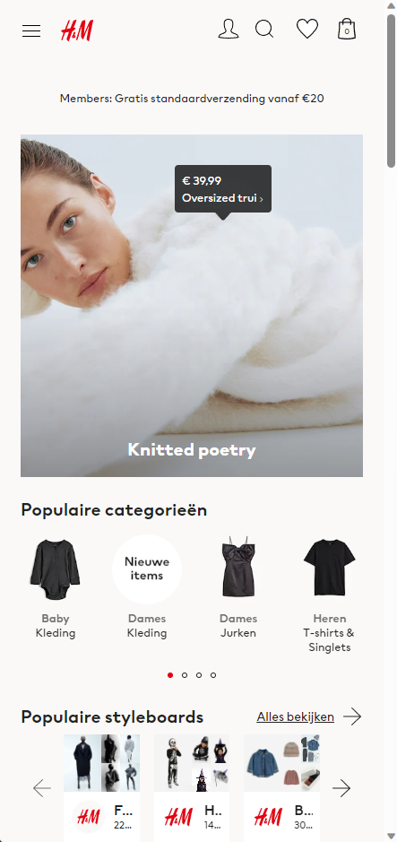
  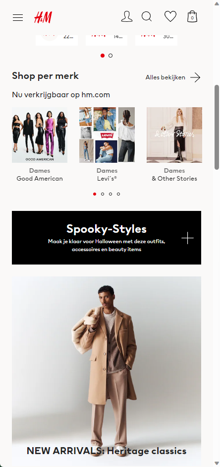
  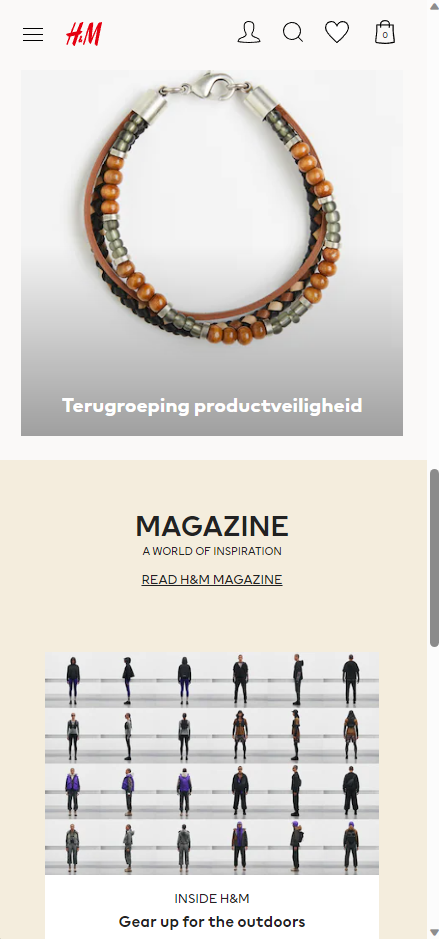
  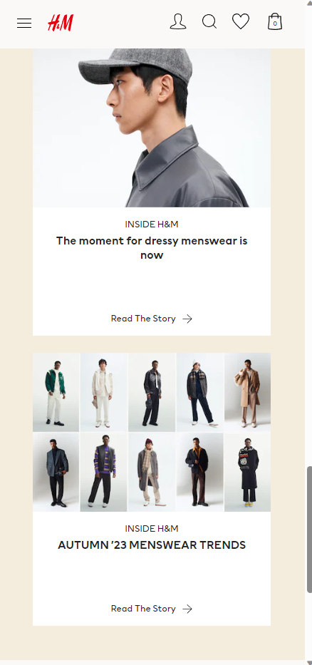
  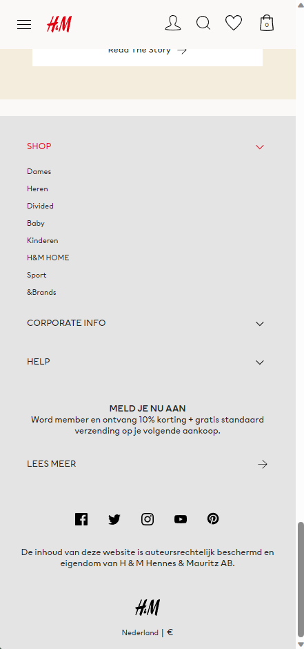

  
 

## Toegankelijkheidstest 1/2 (week 1)

  ### Bevindingen
  Lijst met bevindingen die in de test naar voren kwamen:
  
  . Veel gebruik gemaakt van div

  . Geen h1

  . Geen alt text

  . Alle fotos hadden verwarrende namen, zoals asdkh6ad99.jpg

## Breakdownschets (week 1)

  ### de hele pagina: 
  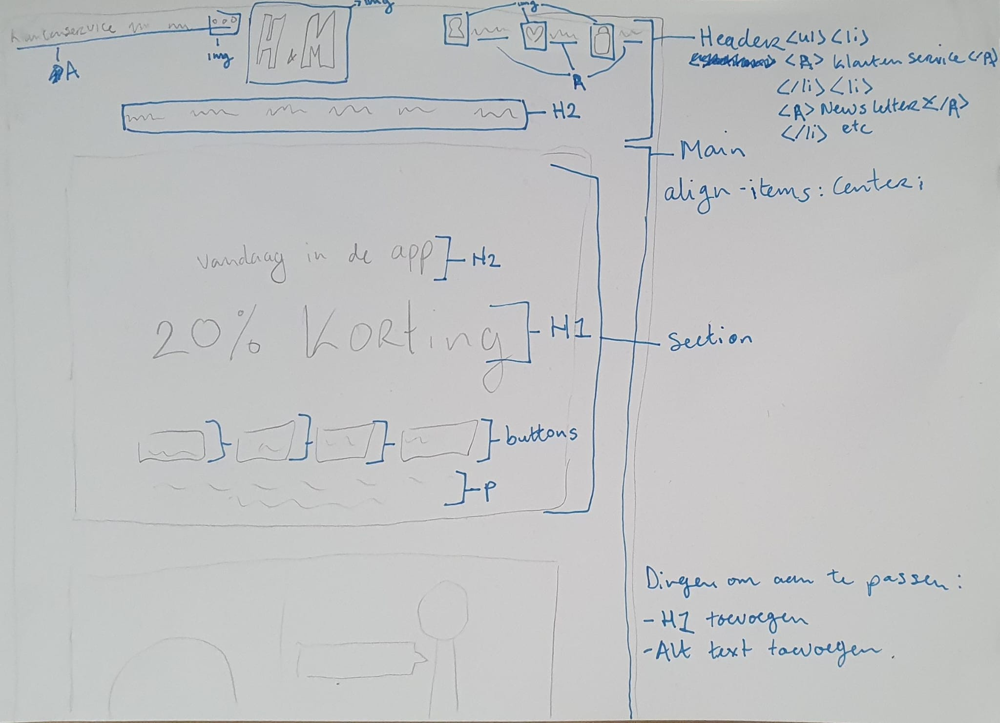

  ### dynamisch deel: 
  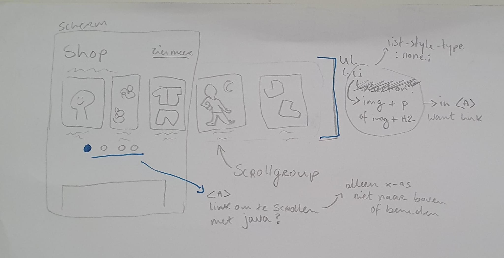

## Voortgang 1 (week 2)

  ### Stand van zaken
  hier dit ging goed & dit was lastig (neem ook screenshots op van delen van je website en code)

  ### Agenda voor meeting
  samen met je groepje opstellen

  | student 1      | student 2          | student 3    | student 4        |
  | ---            | ---                | ---          | ---              |
  | dit bespreken  | en dit             | en ik dit    | en dan ik dat    |
  | en dat ook nog | dit als er tijd is | nog een punt | dit wil ik zeker |
  | ...            | ...                | ...          | ...              |

  ### Verslag van meeting
  hier na afloop snel de uitkomsten van de meeting vastleggen

  - punt 1
  - punt 2
  - nog een punt
  - ...

## Voortgang 2 (week 3)

  ### Stand van zaken
  hier dit ging goed & dit was lastig (neem ook screenshots op van delen van je website en code)

  ### Agenda voor meeting
  samen met je groepje opstellen

  | student 1      | student 2          | student 3    | student 4        |
  | ---            | ---                | ---          | ---              |
  | dit bespreken  | en dit             | en ik dit    | en dan ik dat    |
  | en dat ook nog | dit als er tijd is | nog een punt | dit wil ik zeker |
  | ...            | ...                | ...          | ...              |

  ### Verslag van meeting
  hier na afloop snel de uitkomsten van de meeting vastleggen

  - punt 1
  - punt 2
  - nog een punt
- ...

## Toegankelijkheidstest 2/2 (week 4)

  ### Bevindingen
  Lijst met je bevindingen die in de test naar voren kwamen (geef ook aan wat er verbeterd is):

## Voortgang 3 (week 4)

  ### Stand van zaken
  hier dit ging goed & dit was lastig (neem ook screenshots op van delen van je website en code)

  ### Agenda voor meeting
  samen met je groepje opstellen

  | student 1      | student 2          | student 3    | student 4        |
  | ---            | ---                | ---          | ---              |
  | dit bespreken  | en dit             | en ik dit    | en dan ik dat    |
  | en dat ook nog | dit als er tijd is | nog een punt | dit wil ik zeker |
  | ...            | ...                | ...          | ...              |

  ### Verslag van meeting
  hier na afloop snel de uitkomsten van de meeting vastleggen

  - punt 1
  - punt 2
  - nog een punt
  - ...

## Eindgesprek (week 5)

  ### Je uitkomst - karakteristiek screenshots:
  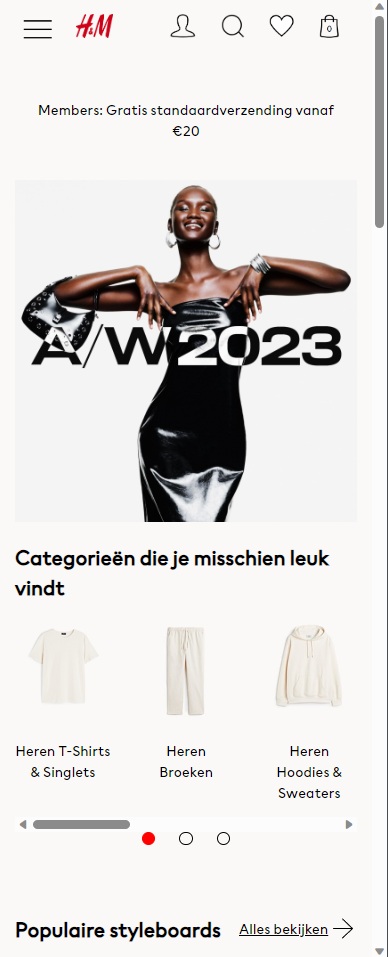
  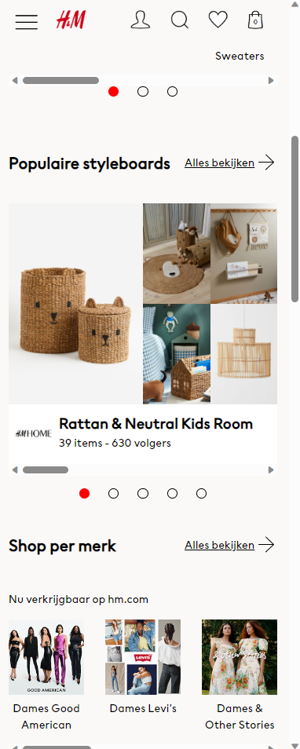
  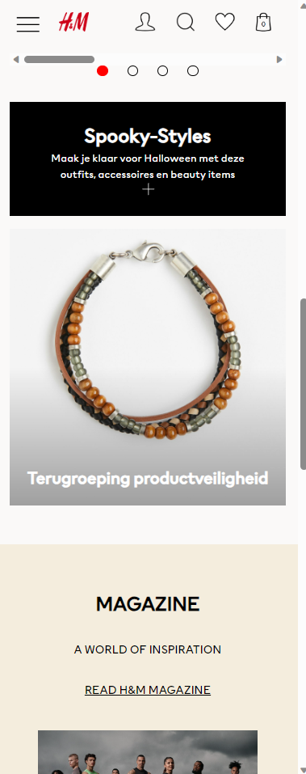
  
  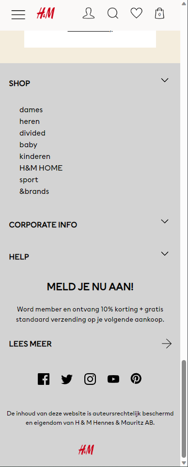

  ### Dit ging goed/Heb ik geleerd: 
  Iets waar ik echt trots op ben is het feit dat wanneer je op en rond knopje klikt, de pagina ook echt door-scrollt tot je bij het gewenste plaatje bent. Ook ben ik erg blij met mijn grids. Voor deze opdracht wist ik niet eens dat display: grid; een optie was, dus ik vind dat ik het prima gedaan heb.  

  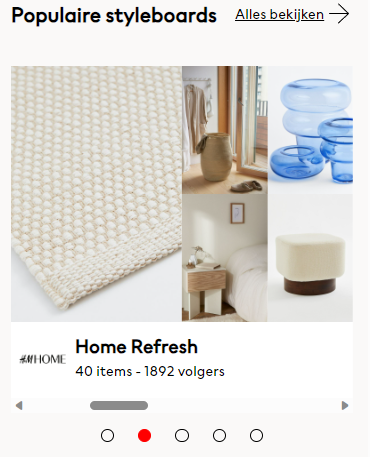

  ### Dit was lastig/Is niet gelukt:
  Het lukte mij helaas niet omervoor te zorgen dat wanneer de gebruiker handmatig scrollt, de bolletjes ook meebewegen en rood worden op de juiste slide

  

## Bronnenlijst

  1. https://www.w3schools.com/css/css3_animations.asp
  2. https://linuxhint.com/rotate-animation-css/
  3. https://stackoverflow.com/questions/22252472/how-can-i-change-the-color-of-an-svg-element
  4. https://codepen.io/sosuke/pen/Pjoqqp
  5. Evi Wammes (klasgenoot)
  6. Marten Moolenaar (docent)
  7. alle opdrachten uit de les
  8. https://cssgridgarden.com/#nl
  9. https://www.w3schools.com/html/html_favicon.asp

